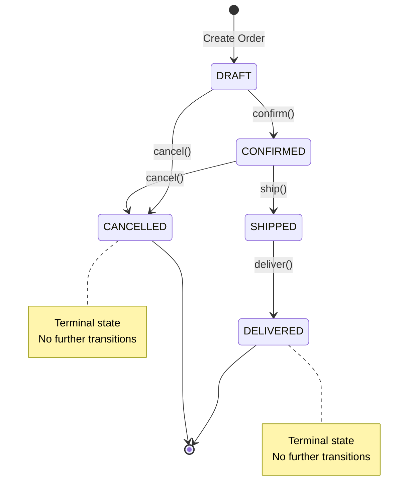

# 🛒 Order Create Service

[](https://kotlinlang.org/)
[](https://spring.io/projects/spring-boot)
[](https://kafka.apache.org/)
[](LICENSE)

A production-grade **Order Create microservice** demonstrating **Event-Driven Architecture**, **Hexagonal Architecture** (Ports & Adapters), **Domain-Driven Design**, and modern Spring Boot best practices with Kotlin.

## 📋 Overview

This service provides an event-driven order creation system that consumes order events from checkout service and persists order metadata with:

- ✅ **Event-Driven Architecture** - Kafka event consumption from checkout service
- ✅ **Hexagonal Architecture** - Clean separation of concerns with pure domain layer
- ✅ **Domain-Driven Design** - Rich domain model with business logic
- ✅ **Kafka Integration** - Consumes OrderCreatedEvent from checkout service
- ✅ **Snapshot Storage** - Persists shipment, release, and status tracking metadata
- ✅ **Kotlin Coroutines** - Async/non-blocking operations
- ✅ **PostgreSQL** - Production-ready relational database
- ✅ **Flyway** - Database migration management
- ✅ **Docker Compose** - Local development environment with Kafka
- ✅ **Dual-mode Operation** - REST API + Kafka consumer for flexibility

### Key Features

- Consume order created events from Kafka (checkout-order-create topic)
- Persist order and order line metadata
- Store snapshot details of shipments, releases, and status tracking
- Order lifecycle management (Draft → Confirmed → Shipped → Delivered)
- Rich domain model with business rule enforcement
- Type-safe value objects (OrderId, CustomerId, ProductId, Money)
- Comprehensive error handling and validation
- RESTful API for backward compatibility and queries
- Health checks and metrics (Actuator)
- Platform Gradle Plugins for zero-config Spring Boot setup

## 🏗️ Architecture

### Hexagonal Architecture (Ports & Adapters)


### Layer Responsibilities

#### 🎯 Domain Layer (Core)
- **Pure Kotlin** - Zero framework dependencies
- **Rich Domain Model** - Business logic lives here
- **Value Objects** - Type-safe IDs, Money
- **Aggregates** - Order (root), OrderItem
- **Business Rules** - Enforced at domain level

#### 🔧 Application Layer
- **Use Cases** - Input ports (CreateOrder, GetOrder, etc.)
- **Output Ports** - Interfaces for infrastructure (LoadOrder, SaveOrder)
- **Orchestration** - Coordinates domain objects
- **Transaction Boundaries** - @Transactional

#### 🔌 Adapter Layer
- **Driving Adapters** - REST controllers (web)
- **Driven Adapters** - JPA repositories (persistence)
- **Mappers** - MapStruct for DTO conversions
- **All Framework Code** - Spring, JPA, Jackson

### Domain Model

```mermaid
classDiagram
    class Order {
        +OrderId id
        +CustomerId customerId
        +OrderStatus status
        +List~OrderLine~ lines
        +Address shippingAddress
        +Address billingAddress
        +Money totalAmount
        +create() Order
        +confirm() void
        +ship() void
        +deliver() void
        +cancel() void
    }

    class OrderLine {
        +LineItemId id
        +ProductId productId
        +String itemName
        +int quantity
        +Money unitPrice
        +Money subtotal
        +create() OrderLine
    }

    class OrderStatus {
        <<enumeration>>
        DRAFT
        CONFIRMED
        SHIPPED
        DELIVERED
        CANCELLED
    }

    class Money {
        <<value object>>
        +BigDecimal amount
        +Currency currency
        +of() Money
    }

    class Address {
        <<value object>>
        +String fullName
        +String addressLine1
        +String city
        +of() Address
    }

    Order "1" *-- "many" OrderLine
    Order --> OrderStatus
    Order --> Money
    Order --> Address
    OrderLine --> Money

    note for Order "Business Rules:\n✓ Must have at least one line\n✓ All items same currency\n✓ Status transitions validated\n✓ Cannot ship cancelled orders"
```



## 🚀 Quick Start

### Prerequisites

- **Java 21+** (JDK)
- **Docker** (for PostgreSQL)
- **Gradle 8.11+** (or use included wrapper)
- **IntelliJ IDEA** (recommended for .http files)

### 5-Minute Setup

```bash
# 1. Clone the repository
git clone https://github.com/bala-lab-projects/order-create-service.git
cd order-create-service

# 2. Start PostgreSQL and Kafka
docker-compose up -d postgres kafka zookeeper

# 3. Run database migrations
make db-migrate

# 4. Build the application
make build

# 5. Run the service
make run
```

The service will start at `http://localhost:8080`

### Verify Installation

```bash
# Check health
curl http://localhost:8080/actuator/health

# Or use Makefile
make health-check
```

## 📚 API Documentation

### Base URL
- **Development**: `http://localhost:8080`
- **Production**: `https://api.production.com`

### Endpoints

#### Order Management

| Method | Endpoint | Description | Auth Groups |
|--------|----------|-------------|-------------|
| `POST` | `/api/v1/orders` | Create order | order-admins, order-users |
| `GET` | `/api/v1/orders/{id}` | Get order by ID | - |
| `GET` | `/api/v1/orders` | List orders (paginated) | - |
| `GET` | `/api/v1/orders?customerId={id}` | Get customer orders | - |
| `POST` | `/api/v1/orders/{id}/confirm` | Confirm order | order-admins |
| `POST` | `/api/v1/orders/{id}/ship` | Ship order | order-admins |
| `POST` | `/api/v1/orders/{id}/deliver` | Deliver order | order-admins |
| `POST` | `/api/v1/orders/{id}/cancel` | Cancel order | order-admins, order-users |
| `PATCH` | `/api/v1/orders/{id}/status` | Update status | order-admins, order-users |
| `DELETE` | `/api/v1/orders/{id}` | Delete order | order-admins |

#### Health & Monitoring

| Method | Endpoint | Description |
|--------|----------|-------------|
| `GET` | `/actuator/health` | Health status |
| `GET` | `/actuator/health/liveness` | Liveness probe |
| `GET` | `/actuator/health/readiness` | Readiness probe |
| `GET` | `/actuator/info` | App information |
| `GET` | `/actuator/metrics` | Metrics |
| `GET` | `/actuator/prometheus` | Prometheus metrics |

### Example Request

```bash
# Create an order
curl -X POST http://localhost:8080/api/v1/orders \
  -H "Content-Type: application/json" \
  -H "X-User-Id: user-123" \
  -H "X-User-Groups: order-users" \
  -d '{
    "customerId": "CUST-001",
    "items": [
      {
        "productId": "PROD-001",
        "quantity": 2,
        "unitPrice": 29.99,
        "currency": "USD"
      }
    ]
  }'
```

### Testing with IntelliJ .http Files

Open `api/orders.http` in IntelliJ IDEA and click the play button (▶) next to any request.

See [api/README.md](api/README.md) for detailed API testing guide.

## 🗄️ Database

### Schema

```sql
-- Orders table
CREATE TABLE orders (
    id UUID PRIMARY KEY,
    customer_id VARCHAR(100) NOT NULL,
    status VARCHAR(20) NOT NULL,
    total_amount NUMERIC(15, 2) NOT NULL,
    currency VARCHAR(3) NOT NULL,
    created_at TIMESTAMP NOT NULL,
    updated_at TIMESTAMP NOT NULL
);

-- Order items table
CREATE TABLE order_items (
    id BIGSERIAL PRIMARY KEY,
    order_id UUID NOT NULL,
    product_id VARCHAR(100) NOT NULL,
    quantity INT NOT NULL CHECK (quantity > 0),
    unit_price NUMERIC(15, 2) NOT NULL,
    FOREIGN KEY (order_id) REFERENCES orders(id) ON DELETE CASCADE
);
```

### Migrations

Flyway manages all database schema changes:

```bash
# Apply migrations
make db-migrate

# View migration status
./gradlew flywayInfo

# Clean and re-migrate (DESTRUCTIVE!)
make db-reset
```

Migration files are in `src/main/resources/db/migration/`:
- `V1__create_orders_table.sql`
- `V2__create_order_items_table.sql`
- `V3__add_order_analytics_indexes.sql`
- `R__create_order_views.sql` (repeatable)

## 🛠️ Development

### Platform Gradle Plugins

This project uses the **Platform Gradle Plugins** to enforce best practices and eliminate boilerplate build configuration.

**What you get automatically:**
- ✅ **Java 21** toolchain
- ✅ **Spring Boot Web** (MVC, Validation, AOP)
- ✅ **Code formatting** via Spotless (google-java-format, ktlint)
- ✅ **Automatic removal of unused imports**
- ✅ **JaCoCo code coverage** with comprehensive reporting
- ✅ **Lombok** for reducing boilerplate
- ✅ **Apache Commons Lang3** utilities
- ✅ **MapStruct** for type-safe object mapping
- ✅ **Comprehensive testing** (JUnit 5, MockK, Spring Test)
- ✅ **Strict dependency resolution** (fails on conflicts)

**Simple build configuration:**
```kotlin
// settings.gradle.kts
pluginManagement {
    repositories {
        mavenLocal()  // Platform plugins published here
        gradlePluginPortal()
    }
}

// orders/orders-app/build.gradle.kts
plugins {
    id("io.github.balaelangovan.spring-web-conventions") version "1.0.0"
}

dependencies {
    // Only add project-specific dependencies
    implementation("org.springframework.boot:spring-boot-starter-data-jpa")
    implementation("org.springframework.kafka:spring-kafka")
    runtimeOnly("org.postgresql:postgresql")
}
```

**That's it!** No need to manually configure Spring Boot plugins, dependency management, code formatting, testing, or toolchains.

**Included dependencies (automatic):**
- `spring-boot-starter-web` (MVC, Tomcat, Jackson)
- `spring-boot-starter-validation` (Bean Validation)
- `spring-boot-starter-aop` (Aspect-Oriented Programming)
- `spring-boot-starter-test` (JUnit 5, Mockito, AssertJ)
- `kotlin-reflect` (Kotlin reflection)
- `jackson-module-kotlin` (JSON serialization)
- `mapstruct` + annotation processor
- `lombok` + annotation processor
- `commons-lang3` (StringUtils, etc.)

**Add only what you need:**
- `spring-boot-starter-data-jpa` (for database access)
- `spring-kafka` (for Kafka integration)
- `postgresql` (database driver)
- Project-specific dependencies

**Before (manual configuration):**
```kotlin
plugins {
    kotlin("jvm")
    kotlin("plugin.spring")
    id("org.springframework.boot")
    id("io.spring.dependency-management")
    // ... more plugins
}

dependencies {
    implementation("org.springframework.boot:spring-boot-starter-web")
    implementation("org.springframework.boot:spring-boot-starter-validation")
    implementation("org.springframework.boot:spring-boot-starter-aop")
    implementation("org.jetbrains.kotlin:kotlin-reflect")
    implementation("com.fasterxml.jackson.module:jackson-module-kotlin")
    testImplementation("org.springframework.boot:spring-boot-starter-test")
    // ... 15+ more dependencies
}
```

**After (with plugin):**
```kotlin
plugins {
    id("io.github.balaelangovan.spring-web-conventions") version "1.0.0"
}

dependencies {
    // Only your specific dependencies
    implementation("org.springframework.boot:spring-boot-starter-data-jpa")
    implementation("org.springframework.kafka:spring-kafka")
    runtimeOnly("org.postgresql:postgresql")
}
```

**Benefits:**
- **70% less build configuration** - From 50+ lines to ~15 lines
- **Automatic updates** - Update plugin version to get latest best practices
- **Consistent standards** - All projects follow same conventions
- **Zero configuration** - Spotless, JaCoCo, MapStruct just work

### Makefile Commands

```bash
make help              # Show all commands
make build             # Build application
make test              # Run tests
make run               # Run locally (dev profile)
make docker-up         # Start PostgreSQL
make docker-down       # Stop containers
make db-migrate        # Run Flyway migrations
make db-reset          # Reset database
make clean             # Clean build artifacts
make format            # Format code
make health-check      # Check app health
```

### Project Structure

```
order-create-service/
├── orders/
│   ├── orders-domain/             # 🎯 DOMAIN LAYER (Pure Kotlin)
│   │   ├── aggregate/             # Order, OrderLine aggregates
│   │   ├── valueobject/           # OrderId, Money, Address VOs
│   │   ├── port/in/               # Input ports (use cases)
│   │   ├── port/out/              # Output ports (persistence, notification)
│   │   ├── service/               # Domain services
│   │   ├── exception/             # Domain exceptions
│   │   ├── event/                 # Event models (OrderCreatedEvent)
│   │   └── mapper/                # DomainMapper interface
│   │
│   ├── orders-app/                # 🔧 APPLICATION LAYER
│   │   ├── controller/            # REST controllers
│   │   ├── dto/                   # Request/Response DTOs
│   │   ├── mapper/                # RequestMapper, ResponseMapper
│   │   ├── orchestrator/          # OrderOrchestrator (use case impl)
│   │   ├── exception/             # GlobalExceptionHandler
│   │   └── resources/
│   │       ├── application.yml    # Configuration
│   │       ├── application-kafka.yml  # Kafka configuration
│   │       └── db/migration/      # Flyway migrations
│   │
│   └── orders-infra/              # 🔌 INFRASTRUCTURE LAYER
│       ├── adapter/               # Driven adapters
│       │   ├── OrderRepositoryAdapter.kt
│       │   ├── LoggingNotificationAdapter.kt
│       │   └── OrderEventConsumerAdapter.kt  # Kafka consumer
│       ├── mapper/                # PersistenceMapper, OrderEventMapper
│       ├── entity/                # JPA entities
│       │   ├── OrderEntity.kt
│       │   ├── ShipmentSnapshotEntity.kt
│       │   └── ReleaseSnapshotEntity.kt
│       ├── repository/            # Spring Data JPA repositories
│       └── config/                # ApplicationConfig
│
├── api/                           # IntelliJ .http test files
├── docker-compose.yml             # PostgreSQL + Kafka + Zookeeper
├── Dockerfile
├── Makefile
└── README.md
```

### Running Tests

```bash
# All tests
make test

# Unit tests only
make test-unit

# Integration tests only
make test-integration
```

### Code Quality

```bash
# Format code
make format

# Check formatting
make check-format
```

## 🐳 Docker

### Local Development with Docker Compose

```bash
# Start PostgreSQL only
make docker-up

# Start with Redis (Phase 2)
docker-compose --profile with-redis up -d

# Start everything including app
docker-compose --profile with-app up -d

# View logs
docker-compose logs -f

# Stop all
make docker-down
```

### Build Docker Image

```bash
# Build image
make docker-build

# Run container
make docker-run
```

### Multi-stage Dockerfile

The included `Dockerfile` uses multi-stage builds:
- **Stage 1**: Build with Gradle
- **Stage 2**: Run with JRE (optimized for production)

## 📊 Monitoring & Observability

### Health Checks

```bash
# Liveness probe (is app alive?)
curl http://localhost:8080/actuator/health/liveness

# Readiness probe (is app ready for traffic?)
curl http://localhost:8080/actuator/health/readiness
```

### Metrics

```bash
# All metrics
curl http://localhost:8080/actuator/metrics

# JVM memory
curl http://localhost:8080/actuator/metrics/jvm.memory.used

# Prometheus endpoint
curl http://localhost:8080/actuator/prometheus
```

### Logging

Logs include:
- Request/response logging (from platform-commons)
- Transaction IDs for tracing
- MDC (Mapped Diagnostic Context)
- Structured JSON logging (configurable)

## 🔐 Security

### Authorization

Uses `@Authorization` annotation from platform-commons:

```kotlin
@PostMapping
@Authorization(authorizedGroups = ["order-admins", "order-users"])
fun createOrder(@RequestBody request: CreateOrderRequest): OrderResponse
```

### Headers

All requests require:
- `X-User-Id`: User identifier
- `X-User-Groups`: Comma-separated authorized groups
- `X-Transaction-Id`: Unique transaction ID (optional)

## 🚦 Order State Machine



## 🎯 Architecture Decisions

### Why Hexagonal Architecture?

1. **Pure Domain Layer** - Business logic isolated from frameworks
2. **Testability** - Easy to test domain without infrastructure
3. **Flexibility** - Swap out adapters (REST → GraphQL, JPA → MongoDB)
4. **Maintainability** - Clear separation of concerns

### Why Platform Gradle Plugins?

1. **Eliminate Boilerplate** - No need to copy-paste build configuration across projects
2. **Enforce Standards** - Consistent code formatting, testing, and coverage across all projects
3. **Automatic Updates** - Update plugin version once to get latest best practices everywhere
4. **Zero Configuration** - Spotless, JaCoCo, MapStruct, Lombok work out of the box
5. **Reduce Cognitive Load** - Developers focus on business logic, not build configuration
6. **Production-Ready Defaults** - Java 21, Spring Boot best practices, strict dependency resolution

### Why Kotlin?

1. **Data Classes** - No need for Lombok
2. **Null Safety** - Fewer NullPointerExceptions
3. **Coroutines** - Better async/concurrency model
4. **Inline Value Classes** - Zero-overhead type-safe IDs
5. **Expressive Syntax** - Less boilerplate than Java

### Why Value Objects?

1. **Type Safety** - Cannot mix OrderId with CustomerId
2. **Domain Clarity** - `Money` vs `BigDecimal`
3. **Validation** - Rules enforced at creation
4. **Immutability** - Thread-safe by default

## 📈 Performance

### Database Indexes

Strategic indexes for common queries:
- Customer lookup: `idx_orders_customer_id`
- Status filtering: `idx_orders_status`
- Time-based queries: `idx_orders_created_at`
- Composite: `idx_orders_customer_status`
- Partial index for active orders

### Connection Pooling

HikariCP configuration:
- Max pool size: 10 (dev), 20 (prod)
- Connection timeout: 30s
- Idle timeout: 10min

### Async Operations

Kotlin coroutines with `suspend` functions for non-blocking I/O.

## 🎯 Event-Driven Architecture

### Event Flow


### Event Schema

The service consumes `OrderCreatedEvent` with the following structure:
- Order metadata (orderId, customerId, orderLines, addresses, notes)
- Shipment snapshot (shipmentId, carrier, trackingNumber, estimatedDelivery)
- Release snapshot (releaseId, releaseDate, releaseStatus, warehouseLocation)
- Status tracking (currentStatus, statusHistory)

### Kafka Configuration

- **Topic**: checkout-order-create
- **Consumer Group**: order-create-service
- **Auto Offset Reset**: earliest
- **Manual Commit**: Acknowledgment-based for reliability

## 🔮 Future Enhancements

### Redis Caching
- Cache frequently accessed orders
- Session storage
- Rate limiting

### Enhanced Event Processing
- Event sourcing with full audit trail
- CQRS pattern for read/write separation
- Additional event types (OrderUpdated, OrderShipped, etc.)

### API Enhancements
- GraphQL API for flexible querying
- gRPC API for service-to-service communication
- WebSocket for real-time order status updates

## 🤝 Contributing

This is a demo project, but contributions are welcome!

1. Fork the repository
2. Create a feature branch (`git checkout -b feature/amazing-feature`)
3. Commit your changes (`git commit -m 'Add amazing feature'`)
4. Push to the branch (`git push origin feature/amazing-feature`)
5. Open a Pull Request

## 📄 License

This project is licensed under the MIT License - see the [LICENSE](LICENSE) file for details.

## 🙏 Acknowledgments

- **Spring Boot Team** - Amazing framework
- **Hexagonal Architecture** - Alistair Cockburn
- **Domain-Driven Design** - Eric Evans
- **Platform Commons** - Shared infrastructure components

## 📞 Contact

For questions or feedback:
- GitHub Issues: [Create an issue](https://github.com/bala-lab-projects/order-create-service/issues)
- Email: platform@github.io

---

**Built with ❤️ using Kotlin, Spring Boot, Kafka, and Event-Driven Architecture**
